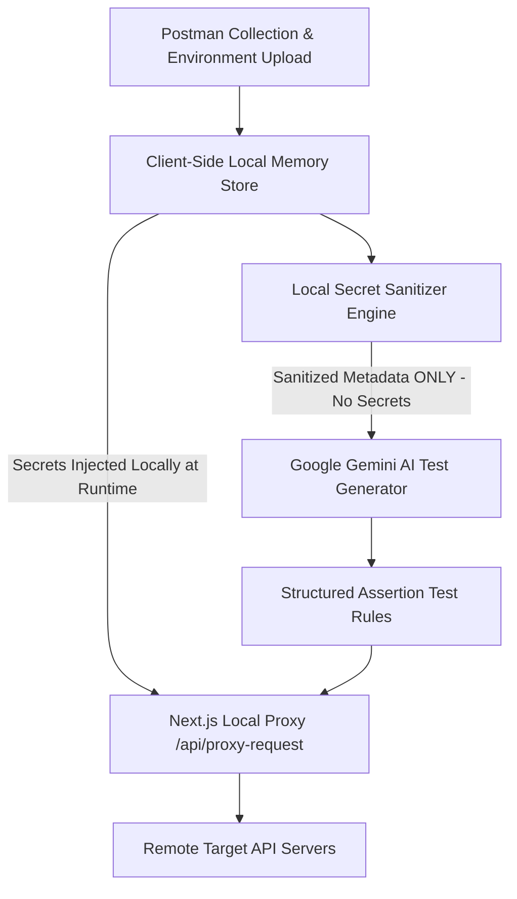

# 🚀 AI-Powered API Collection Runner & Dashboard

> **Intelligent, Automated Postman Collection Runner** powered by Next.js 14, Tailwind CSS, Framer Motion, and Google Gemini API with 100% Local Secret Isolation Guarantee & Live Traffic Telemetry.

---

## 🌟 Core Features & Capabilities

- **📁 File Upload & Postman Schema Parser**: Drag-and-drop Postman Collection JSON (v2.0 & v2.1) and Environment JSON. Preserves exact multi-level folder hierarchy (`Folders -> Subfolders -> Endpoints`).
- **🔐 Postman-Style Environment Variable Manager**: Interactive modal to view, edit, add, and mask sensitive secret keys (`apiKey`, `authToken`, `password`) locally.
- **🛡️ 100% Local Secret Privacy Guarantee**: Environment variables and secret tokens remain 100% strictly local in client memory. Structural metadata is sanitized and masked (`{{REDACTED_SECRET_LOCAL_ONLY}}`) before test script generation.
- **🤖 Automated AI Test Script Generation**: Uses Google Gemini API (`gemini-2.5-flash`) or built-in offline smart heuristic engine to generate validation rules (HTTP status codes, latency SLAs `<2000ms`, JSON schemas, content-type headers, and token extraction).
- **🌲 Hierarchical Tree View Selector**: Interactive multi-level checkbox selection with cascading select/deselect logic and indeterminate folder state handling.
- **⚡ CORS-Bypass Proxy Engine & Real-Time Dashboard**: Next.js server route `/api/proxy-request` executes endpoints server-side to bypass browser CORS restrictions while recording real-time SLA metrics.
- **📡 Live Request Traffic & Routing Simulator**: Real-time traffic stream visualizer highlighting **Route A (Sanitized LLM Payload Path)** vs **Route B (Local Host Target API Proxy Path)**.
- **🔍 Tabbed HTTP Log Inspector Drawer**: Slide-out drawer with tabbed view for formatted JSON response body payloads, AI assertion pass/fail results, request headers, and cURL export generation.

---

## 🔒 Secret Isolation & Zero-Trust Architecture



---

## 🛠️ Tech Stack & Technical Justifications

| Architecture Layer | Selected Technology | Rejected Alternative | Key Technical Justification |
| :--- | :--- | :--- | :--- |
| **Framework** | Next.js 14 (App Router) | Express + React SPA | Next.js unifies SSR frontend with serverless API proxy routes (`/api/proxy-request`) in 1 project. |
| **CORS Bypass** | Server-Side Next.js API Route | Browser Client Fetch | Direct browser fetch fails on target API CORS restrictions; server proxy handles custom headers securely. |
| **Styling & UI** | Tailwind CSS + Framer Motion | Bootstrap / Styled-Components | Utility-first styling speed with zero CSS-in-JS runtime overhead and hardware-accelerated animations. |
| **State Engine** | Zustand | Redux Toolkit / Context API | Minimal 1KB footprint, unopinionated hook API, zero provider wrapper re-render penalties. |
| **AI Generator** | Google Gemini API + Offline Fallback | OpenAI GPT-4 / Newman CLI | Sub-second latency, structured JSON mode output, free tier availability, and 100% offline fallback reliability. |

---

## ☁️ AWS Cloud Production Architecture & Deployment

For enterprise production scaling on AWS, the architecture maps to serverless cloud infrastructure:

- **Frontend & App Hosting**: AWS Amplify / AWS ECS Fargate with CloudFront CDN distribution.
- **CORS Runner Proxy**: AWS API Gateway + AWS Lambda inside private VPC subnets.
- **Encrypted Secrets Vault**: AWS Secrets Manager with KMS envelope encryption (`aws/secretsmanager`).
- **Private LLM Test Generation**: AWS Bedrock (Claude 3.5 Sonnet / Titan) inside private VPC endpoint.
- **Observability**: AWS CloudWatch metrics & AWS X-Ray distributed trace timelines.

---

## 🚀 Getting Started Locally

```bash
# 1. Install dependencies
npm install

# 2. Run local development server
npm run dev

# 3. Open browser
http://localhost:3000
```

---

## 🛣️ Future Scope & Product Roadmap

- [ ] **Q3 2026**: GitHub Actions & GitLab CI/CD Pipeline Headless Runner Integration.
- [ ] **Q4 2026**: OpenAPI 3.0, Swagger & GraphQL Introspection Importer.
- [ ] **Q4 2026**: Automated Webhook Alerts (Slack, Discord, MS Teams, PagerDuty).
- [ ] **Q1 2027**: AI-Driven k6 & Locust Load Stress Testing.

---

## 📜 License
MIT License - Built with ❤️ for API Quality Engineers.
