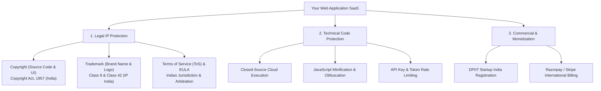

# 🛡️ Intellectual Property (IP) Protection & Monetization Guide for SaaS (India Origin)

This document provides a comprehensive roadmap for protecting your API Testing & Telemetry SaaS application against copying, securing your brand, and establishing a monetization structure originating from India.

---

## 1. International Payment Gateways from India (Serving Worldwide Customers)

Yes! Indian payment gateways like **Razorpay** and **Stripe India** fully support accepting payments from international customers across the US, Europe, Asia, and worldwide in foreign currencies (USD, EUR, GBP, AUD, etc.).

### Recommended Indian Payment Gateways for Global SaaS:

| Payment Gateway | International Support | Key Features for International SaaS |
| :--- | :--- | :--- |
| **Razorpay (India)** | ✅ Yes (Visa, Mastercard, AMEX, Diners) | • Multi-currency pricing (charge in USD/EUR) • Auto-conversion and settlement in INR to your Indian bank account • International Subscription Billing engine |
| **Stripe (India)** | ✅ Yes (Worldwide Cards, Apple Pay, Google Pay) | • Global standard for SaaS subscriptions & billing • Native multi-currency pricing & automatic tax calculations |
| **PayPal India** | ✅ Yes | • Good secondary payment option for US/EU clients who prefer PayPal checkout |

### Compliance Requirements for Exporting SaaS from India:
1. **GST LUT (Letter of Undertaking):** Export of services (SaaS provided to foreign customers) is treated as Zero-Rated under GST if you file an annual LUT on `gst.gov.in`. No GST is charged to foreign customers.
2. **RBI Purpose Code:** International inward remittances will use RBI Purpose Code **P0802** (*Software Consultancy & SaaS Export*).
3. **FIRC / BIRC:** Your Indian bank / payment gateway automatically provides electronic FIRC (Foreign Inward Remittance Certificate) for tax compliance.

---

## 2. Technical Code & Architecture Protection

> [!IMPORTANT]
> **The Golden SaaS Rule:** Never deliver critical business logic or proprietary algorithms exclusively to the user's browser.

1. **Closed-Source SaaS Deployment:** Host the web application on cloud servers (AWS Mumbai / Vercel / GCP). Users only interact with compiled HTML/JS; backend code remains protected on your server.
2. **Minification & Obfuscation:** Next.js Turbopack automatically minifies client JavaScript bundles.
3. **Backend API Authentication:** Validate premium tier access on the server via JWT tokens and encrypted database checks.

---

## 3. How to Protect Your IP in India (Copyright & Trademark)

### Legal Protection Pillars:
- **Trademark (™ / ®):** Register your brand name and logo under **Class 9** (Software) and **Class 42** (SaaS & Cloud Services) on [ipindia.gov.in](https://ipindia.gov.in/).
- **Copyright:** Register your source code repository extracts under *The Copyright Act, 1957* at [copyright.gov.in](https://copyright.gov.in/).
- **Terms of Service (ToS):** Enforce strict anti-reverse-engineering and anti-scraping clauses specifying Indian legal jurisdiction.
- **DPIIT Startup India Recognition:** Register on [startupindia.gov.in](https://www.startupindia.gov.in/) for 80% rebate on Patent filing fees and 50% rebate on Trademark filing fees.
